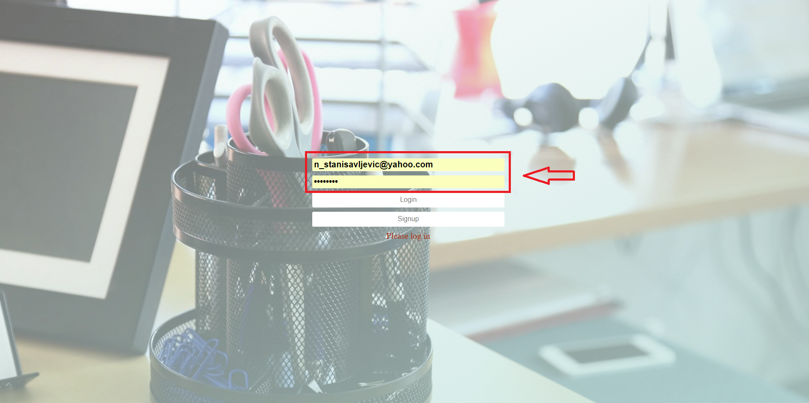
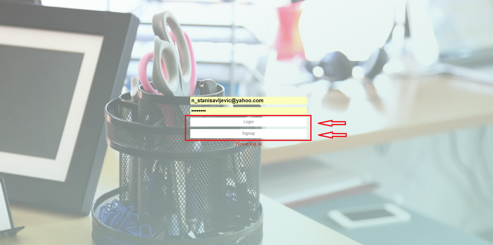
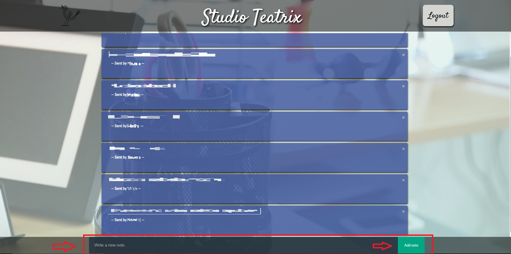
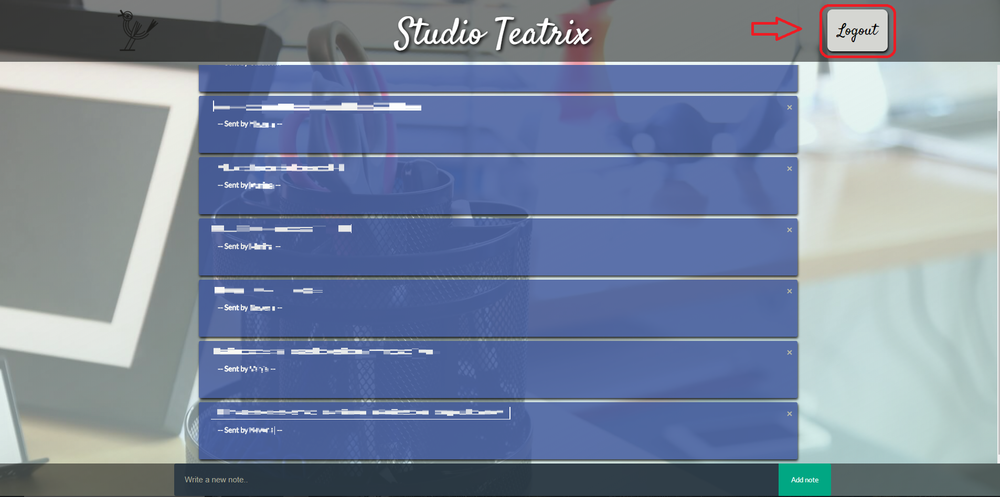

# Teatrix note app

## Description
This note app/to-do list i build using Reactjs for front end framework and using Sass as css preprocessor.Styled mostly using css flexbox as layout model.All data is conneted with Firebase Realtime Database with Hosting and users authentication and it's accessible in any moment even if app goes offline.
It is in production state and used daily by one company. 

## Installation
A step by step of examples  

*If you are using node package manager (npm) first step will be  

`npm install` 

Wait until instalation is finished and type 

`npm start` 

To start live server and preview of app   

*If you are using Yarn first step will be  

`yarn install` 

And after instalation 

`yarn run start` 

## Usage 

*Step 1: Enter your email and password into required fields. 

 

*Step 2: Click/Tap on Singup button to register into database,
or click/tap Login button if you are already registered. 

 

*Step 3: You can enter your note in input field and add as many task you want,
also you can delete them on x button. 

 

*Step 4: After finish menaging your tasks,there is log out button in top right corner. 

  

## Built With

- React.JS - Javascript framework 
- Firebase -  Web application development platform 
- Visual Studio Code -  Source code editor 

## Author

- **Nikola Stanisavljevic**   :+1: